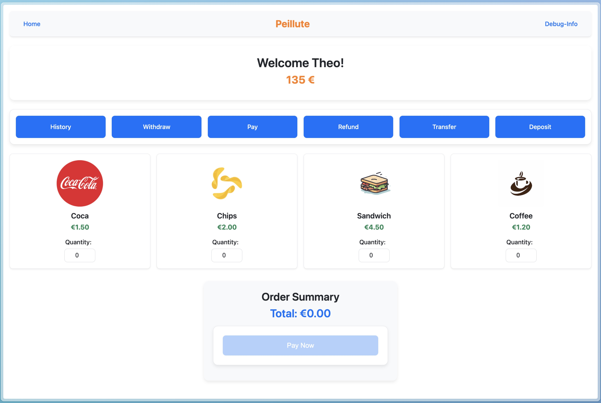
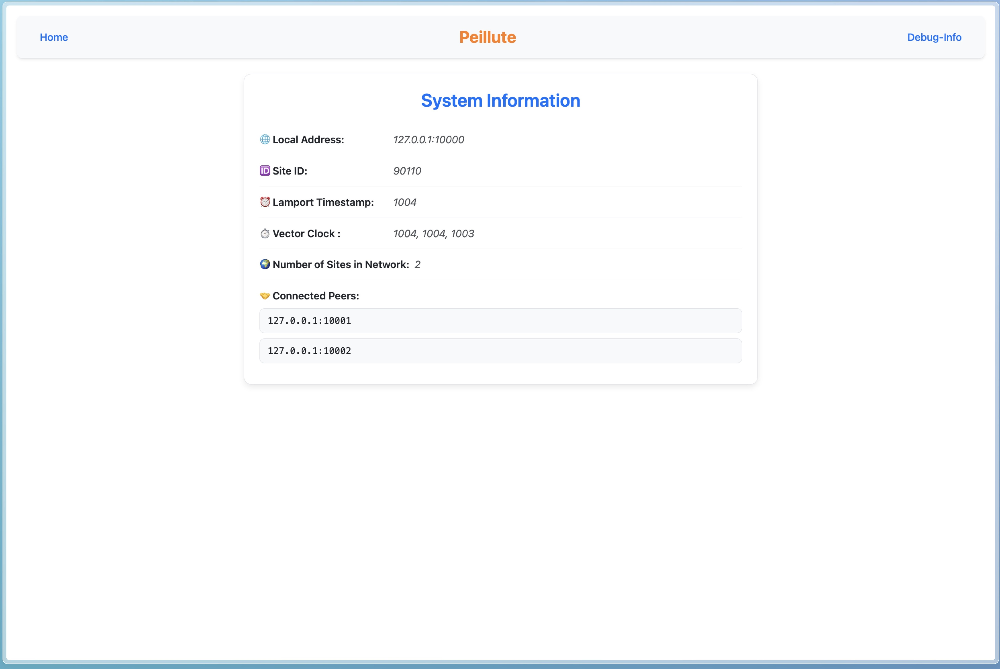
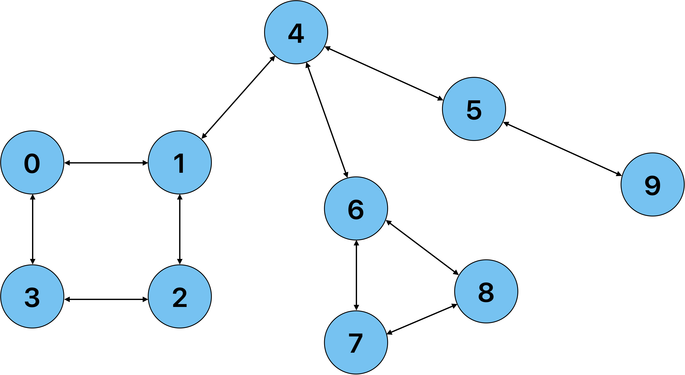

# Peillute - A Distributed Cross-Platform Payment App in Rust

This project aims to recreate "Pay'UTC" as a distributed application in Rust using TCP for communication between nodes. The goal is to maintain a common database on each node using what we learned through the course "SR05" at Université de Technologie de Compiègne.

Each node can be launched independently; they will automatically connect to other instances present in the network and start exchanging data. We use vector clocks to ensure that transactions are processed in the right order, and we also use a snapshot mechanism to ensure that the database is always consistent.

Through this project, we also wanted to create a "production-like" application with all the learning from our internship. That's why we implemented automatic tests, documentation generation, and CI/CD pipelines.

Peillute is available as a terminal application but can also be accessed as a web app using [Dioxus](https://dioxuslabs.com/).

Dioxus allows us to create a web application with a single binary that contains both the server (database, networking, etc.) and the client (UI).

[TOC]

<p align="center">
  
  
</p>

## Project Documentation

The project documentation is automatically generated using `cargo doc` and deployed using the CI/CD pipeline. You can find it here: [peillute](https://guegathe.gitlab.utc.fr/peillute/doc/peillute/)

## 🚀 Installation

### Prerequisites

Make sure you have the following installed on your system:
- Rust
- Cargo
- Dioxus

### 1. Clone the Repository

```sh
git clone https://gitlab.utc.fr/guegathe/peillute.git -j8
```

### 2. Automatically Install Dependencies and Run Peillute Instance

```sh
./launch_peillute_instance.sh

# To be more verbose:
./launch_peillute_instance.sh -debug

# To run in CLI mode without UI:
./launch_peillute_instance.sh -cli

# To run in CLI mode with debug logs:
./launch_peillute_instance.sh -debug -cli

# To run a demo using Dioxus:
./launch_peillute_instance.sh -demo

# To run a demo using Dioxus with debug logs:
./launch_peillute_instance.sh -debug -demo

# To run a demo using CLI mode:
./launch_peillute_instance.sh -demo_cli

# To run a demo using CLI mode with debug logs:
./launch_peillute_instance.sh -debug -demo_cli
```

### 3. Manually Install Dependencies

If you prefer to install dependencies manually, follow these steps:

#### Install Rust

```sh
curl --proto '=https' --tlsv1.2 -sSf https://sh.rustup.rs | sh
```

#### Install Cargo bin-install

```sh
curl -L --proto '=https' --tlsv1.2 -sSf https://raw.githubusercontent.com/cargo-bins/cargo-binstall/main/install-from-binstall-release.sh | bash
```

#### Install Dioxus

```sh
cargo binstall dioxus-cli
```

#### For Linux and Windows Users

Refer to the [Dioxus Getting Started Guide](https://dioxuslabs.com/learn/0.6/getting_started/#) for additional setup instructions.

## 🚀 Compile and Run

### 1. Compile and Run Without the UI

```sh
cargo run
```

### Demonstration of Imperfect Network

The following commands will create a non-perfect network (schema below) with manual peers:

<p align="center">
  
</p>

```sh
# Create a non-perfect network with manual peers:
# Terminal 1
RUST_LOG=debug cargo run -- --port 10000 --peers 127.0.0.1:10001,127.0.0.1:10003 --db-id 1
# Terminal 2
RUST_LOG=debug cargo run -- --port 10001 --peers 127.0.0.1:10000,127.0.0.1:10002,127.0.0.1:10004 --db-id 2
# Terminal 3
RUST_LOG=debug cargo run -- --port 10002 --peers 127.0.0.1:10001,127.0.0.1:10003 --db-id 3
# Terminal 4
RUST_LOG=debug cargo run -- --port 10003 --peers 127.0.0.1:10000,127.0.0.1:10002 --db-id 4
# Terminal 5
RUST_LOG=debug cargo run -- --port 10004 --peers 127.0.0.1:10001,127.0.0.1:10006,127.0.0.1:10005 --db-id 5
# Terminal 6
RUST_LOG=debug cargo run -- --port 10005 --peers 127.0.0.1:10004,127.0.0.1:10006 --db-id 6
# Terminal 7
RUST_LOG=debug cargo run -- --port 10006 --peers 127.0.0.1:10004,127.0.0.1:10007,127.0.0.1:10008 --db-id 7
# Terminal 8
RUST_LOG=debug cargo run -- --port 10007 --peers 127.0.0.1:10006,127.0.0.1:10008 --db-id 8
# Terminal 9
RUST_LOG=debug cargo run -- --port 10008 --peers 127.0.0.1:10006,127.0.0.1:10007 --db-id 9
# Terminal 10
RUST_LOG=debug cargo run -- --port 10009 --peers 127.0.0.1:10005 --db-id 10
```

### 2. Compile with Dioxus (Merges Client and Server)

Dioxus is a full-stack cross-platform framework, so Peillute can be deployed on:

- Linux (Desktop)
- MacOS (Desktop)
- Windows (Desktop)
- Web (Browser)
- Android (Mobile)
- iOS (Mobile)

To compile Peillute with Dioxus, run the following command:

```sh
dx bundle --release --platform web
```

### 3. Run the Binary

Manually run the server:

```sh
# One instance
cd target/dx/peillute/release/web
./server

# Create a non-perfect network with manual peers:
# Terminal 1:
RUST_LOG=debug ./server --port 10000 --peers 127.0.0.1:10001,127.0.0.1:10002
# Terminal 2:
RUST_LOG=debug ./server --port 10001 --peers 127.0.0.1:10000,127.0.0.1:10002
# Terminal 3:
RUST_LOG=debug ./server --port 10002 --peers 127.0.0.1:10000,127.0.0.1:10001
# Terminal 4:
RUST_LOG=debug ./server --port 10003 --peers 127.0.0.1:10001,127.0.0.1:10002
```

## 🛠️ Development and Testing

Unit tests are made to ensure the correctness of the code; they are automatically run using the CI/CD pipeline at each commit.

### Run Unit Tests

```sh
cargo test --all-features
```

### Format the Code

```sh
cargo fmt
```

### Generate the Documentation

```sh
cargo doc
```

## 📜 License

This project is licensed under the MIT License. See the [LICENSE](LICENSE) file for more details.
